

# 〔 Noro's Hyprland Dotfiles 〕

*A Windows-inspired, color-reactive Hyprland setup with themeable bars, menus, and wallpaper-driven styling.*

---

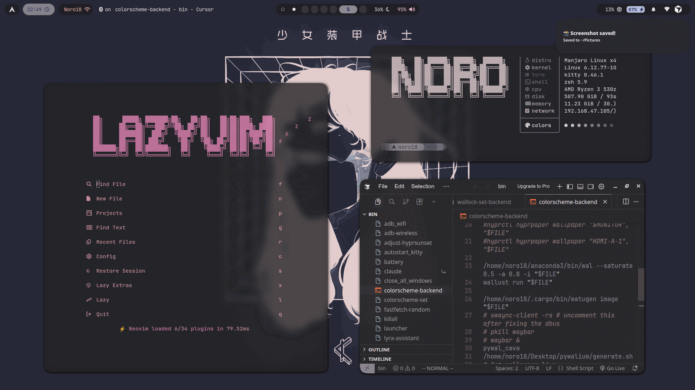

## Overview

This repo contains my personal Hyprland rice: a desktop that mixes Linux flexibility with a polished Windows-like visual language.  
The setup is built around dynamic wallpaper theming, switchable Waybar styles, and menus that are meant to feel cohesive instead of patched together.

## Highlights

### Dynamic Color Pipeline

Wallpaper colors flow through the desktop using **[Matugen](https://github.com/InioX/matugen)** and **[Wallust](https://codeberg.org/explosion-mental/wallust)** so the shell, notifications, terminal, and bars stay visually in sync.

<table>
  <tr>
    <td width="50%">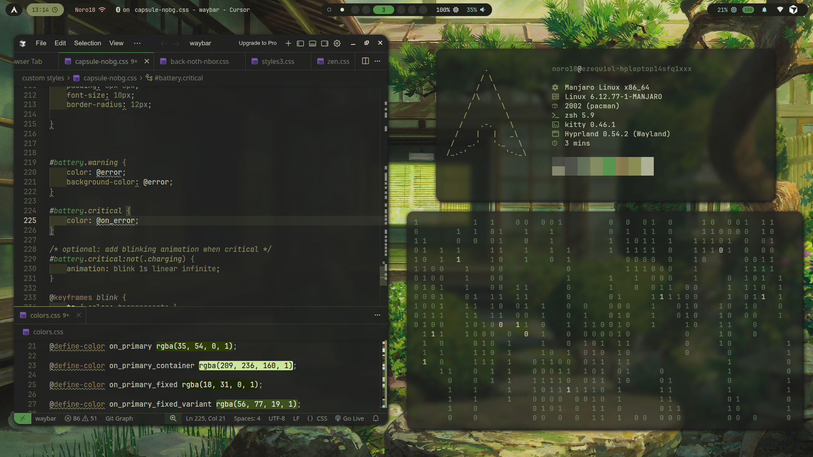</td>
    <td width="50%">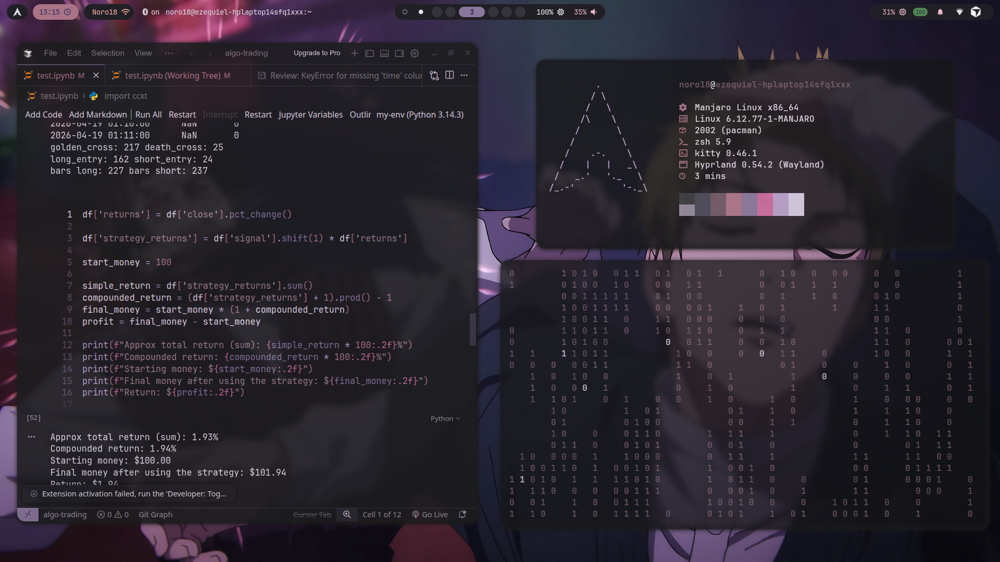</td>
  </tr>
  <tr>
    <td width="50%">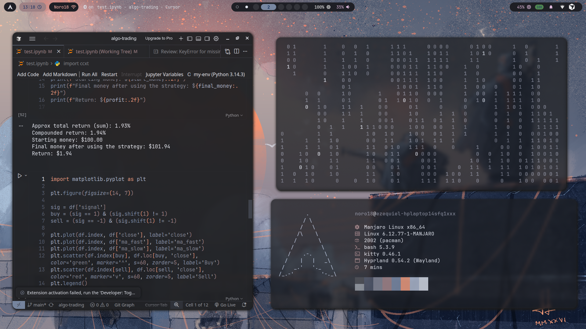</td>
    <td width="50%">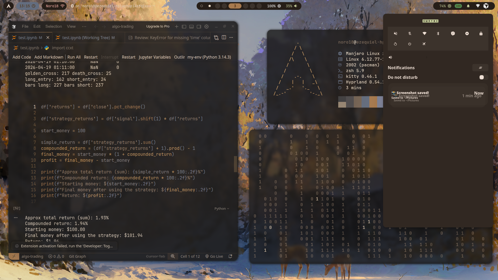</td>
  </tr>
</table>

### Built-In Selectors

The repo includes selectors and menu flows that make it easy to change the look without digging through every config file by hand.

| Wallpaper Selector | Waybar Style Selector |
| --- | --- |
|  | 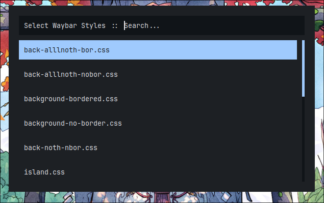 |

## Windows-Inspired Themes

These screenshots from `assets/windows/` show the Windows-style direction of the rice on Linux: centered taskbar layouts, glassy panels, darker Win11-like surfaces, and launcher variants that still fit the Hyprland workflow.

<table>
  <tr>
    <td width="50%" align="center">
      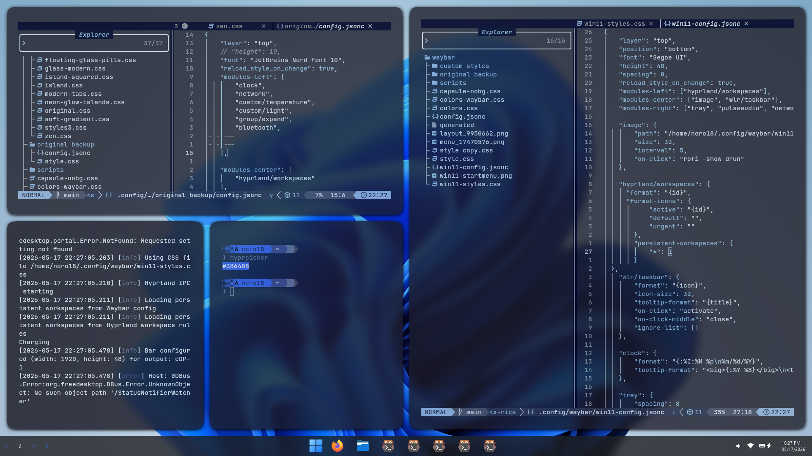
       
      Config-focused workspace with a Windows-style taskbar and soft glass panels.
    </td>
    <td width="50%" align="center">
      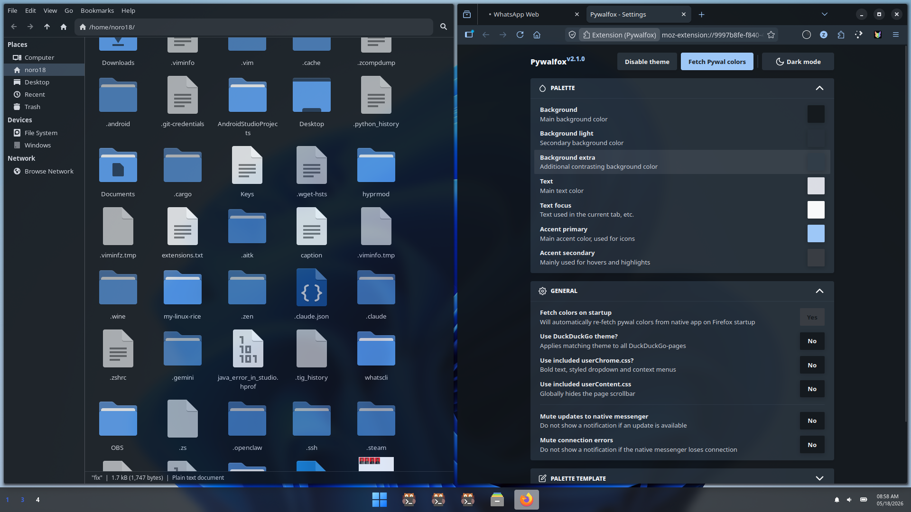
       
      Integrated app styling across Thunar, Firefox, and the desktop shell.
    </td>
  </tr>
  <tr>
    <td width="50%" align="center">
      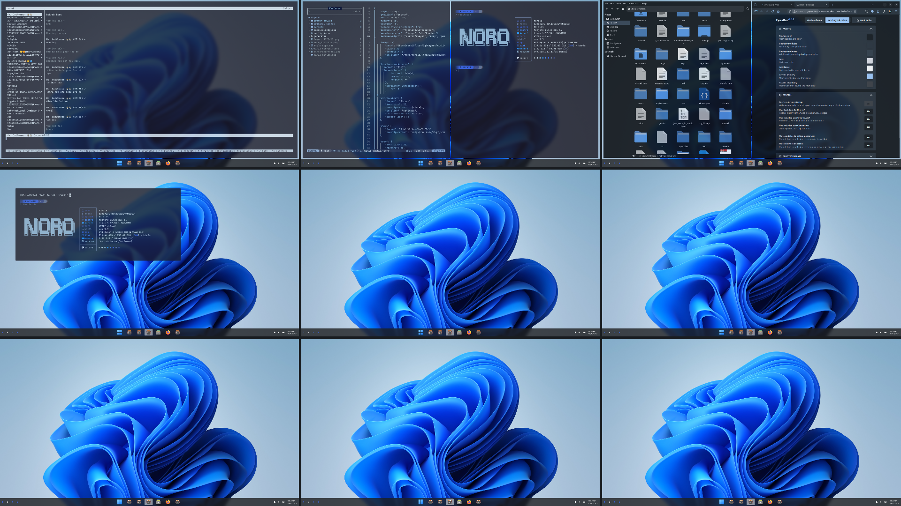
       
      Full desktop composition showing the wallpaper, widgets, and shell pieces working together.
    </td>
    <td width="50%" align="center">
      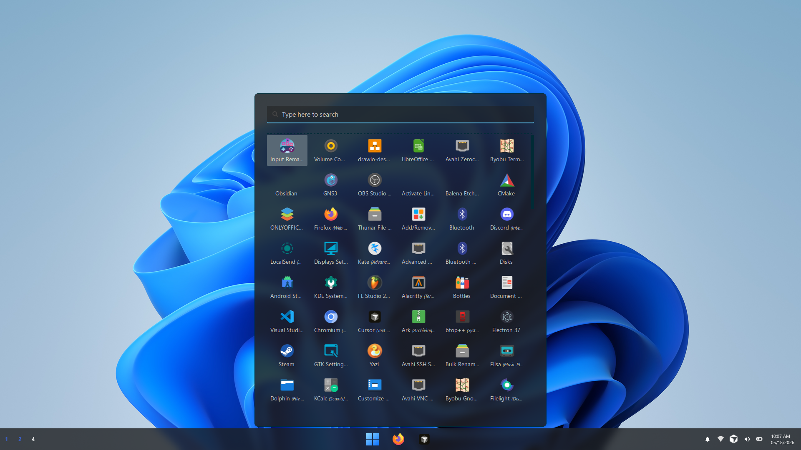
       
      Launcher variant on the light wallpaper profile.
    </td>
  </tr>
  <tr>
    <td colspan="2" align="center">
      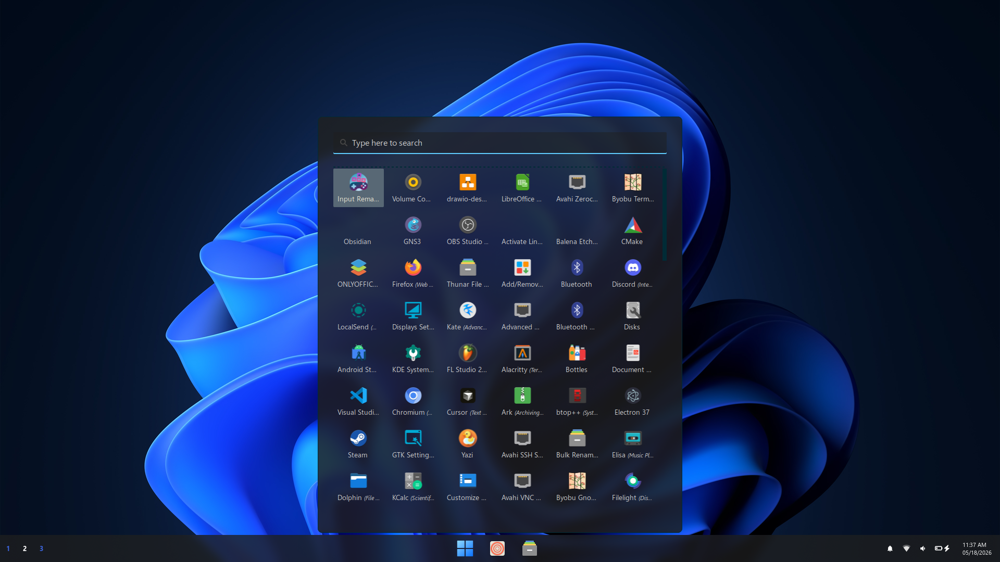
       
      Dark wallpaper profile with the same Windows-like launcher treatment.
    </td>
  </tr>
</table>

## Documentation

| Area | Link |
| --- | --- |
| Architecture Overview | [docs/architecture.md](docs/architecture.md) |
| File Structure | [docs/file-structure.md](docs/file-structure.md) |
| Theming Pipeline | [docs/theming-pipeline.md](docs/theming-pipeline.md) |
| Scripts Reference | [docs/scripts.md](docs/scripts.md) |

### Component Docs

| Component | Link |
| --- | --- |
| Waybar | [docs/components/waybar.md](docs/components/waybar.md) |
| Rofi | [docs/components/rofi.md](docs/components/rofi.md) |
| Hyprland | [docs/components/hyprland.md](docs/components/hyprland.md) |
| Kitty | [docs/components/kitty.md](docs/components/kitty.md) |
| Fastfetch | [docs/components/fastfetch.md](docs/components/fastfetch.md) |
