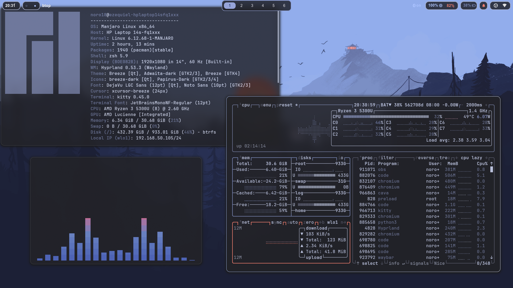
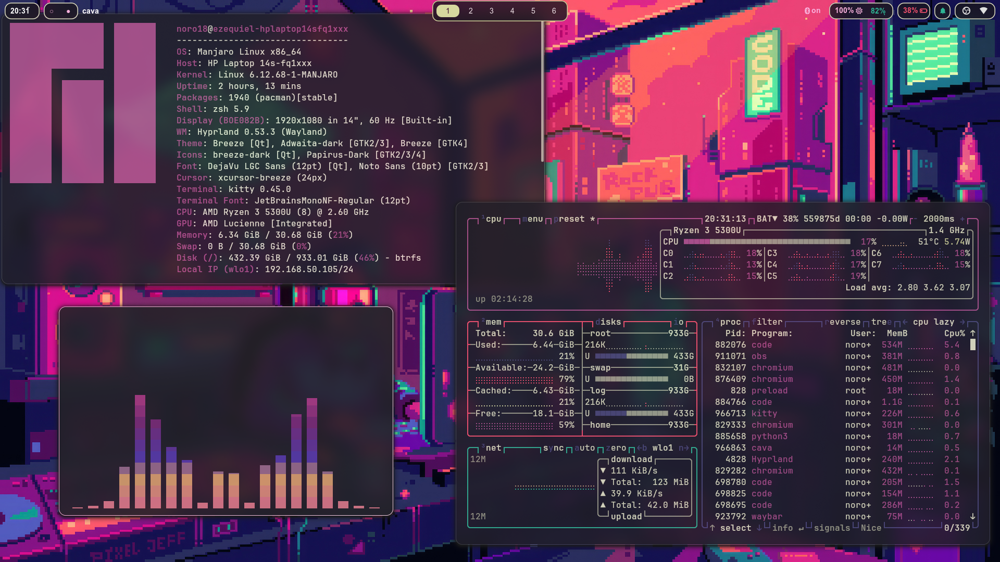
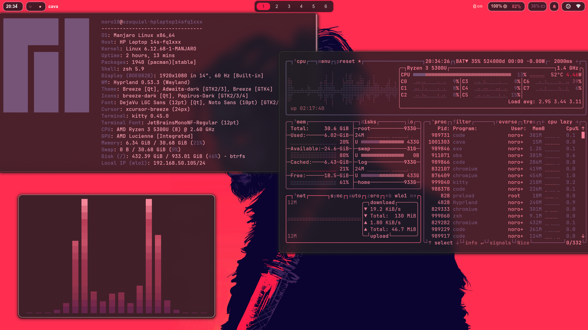
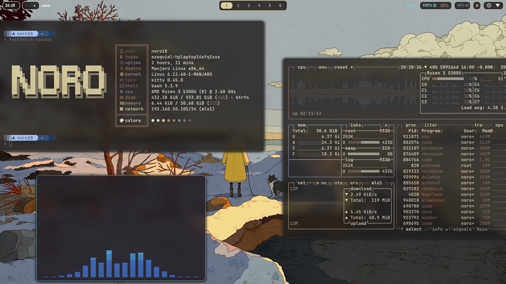
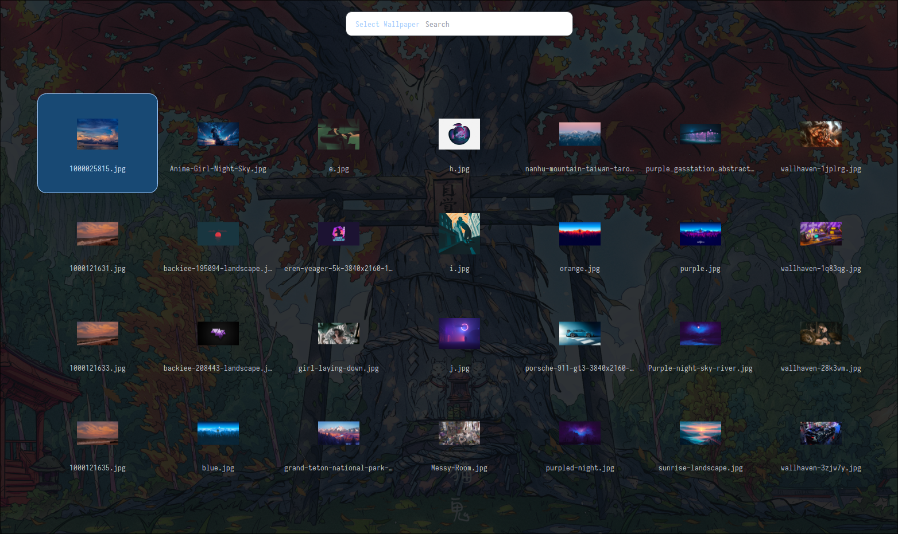

# 〔 Noro's Hyprland Dotfiles 〕

*A dynamic, color-reactive desktop environment for Hyprland*

---

---

## • Overview •

✨ Notable Features

 

### 1. 🎨 Dynamic Color Theming

Colors are generated dynamically from your wallpaper using **[Matugen](https://github.com/InioX/matugen)** and **[Wallust](https://codeberg.org/explosion-mental/wallust)**.

| | |
|:---:|:---:|
|  |  |
|  |  |

---

### 2. 🛠️ Customizable Menus

Pre-built menus that are fully configurable via config files. *(GUI editor coming soon)*

#### 🖼️ Wallpaper Selector

Displays all images inside `~/.config/wallpapers` for easy selection.

#### 🧩 Waybar Style Selector

Switch between Waybar configs stored in `~/.config/waybar/custom styles`.

For more detailed explanation on how Everything works check out

## 📚 Documentation

- [Architecture Overview](docs/architecture.md)
- [File Structure](docs/file-structure.md)
- [Theming Pipeline](docs/theming-pipeline.md)
- [Scripts Reference](docs/scripts.md)

### Components
- [Waybar](docs/components/waybar.md)
- [Rofi](docs/components/rofi.md)
- [Hyprland](docs/components/hyprland.md)
- [Kitty](docs/components/kitty.md)
- [Fastfetch](docs/components/fastfetch.md)

